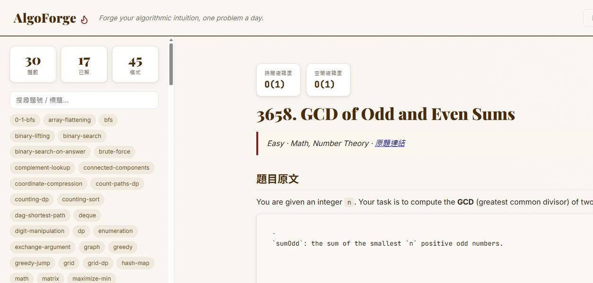

# AlgoForge 🔥

[English](./README.md) | **繁體中文**

> **Forge your algorithmic intuition, one problem a day.**
> 一個 LeetCode 的 AI 解題**教練** —— 它不只給你答案，而是教你**怎麼想**：拿到題目該從哪個角度切入、套什麼模式、時間／空間複雜度怎麼**推導**（而不是背 Big-O）。

AlgoForge 會抓 LeetCode 每日一題（或你指定的任何題），由一個 Claude Code agent 產出結構化、教學優先的分析：思維框架、核心觀念、Java/C++ 解法、複雜度逐步推導、可複用模式 —— 全部存成 Markdown，並在儀表板上瀏覽。



> 📄 實際產出見 [`examples/`](./examples)：例如 [Two Sum](./examples/1-two-sum.md)，或看 [GCD of Odd and Even Sums](./examples/3658-gcd-of-odd-and-even-sums.md) 展示第 9 段「社群解法對照」實際效果。

## 為什麼不一樣

- **教切入法，不只給答案** —— 重現一個強解題者腦中怎麼推進：訊號 → 排除的方向 → 為何收斂到這解法
- **複雜度用推導，不只報結論** —— 說明「哪個迴圈跑幾次」，而非乾巴巴一個 `O(n)`
- **誠實先講暴力解** —— 先給天真解、點出哪裡浪費，**再**引出優化動機
- **歸納成模式** —— 每題掛到可複用模式，下次看到就認得

## 核心：解題教練 agent ⭐

AlgoForge 的靈魂是 [`.claude/agents/algoforge-coach.md`](./.claude/agents/algoforge-coach.md) —— 一個把上述教學規則寫成的 Claude Code subagent。丟進任何 Claude Code 專案，叫它分析一題即可。

## 技術架構

```
LeetCode GraphQL ──► Backend (Python / FastAPI) ──► Markdown 筆記 + index
                          抓題 / 代理 CORS              │
                                                        ├──► Web 儀表板
   你 ◄── 討論 ──► Claude 解題教練 agent ────────────────┘
```

- **後端** —— FastAPI 代理 LeetCode GraphQL（避開 CORS），把題目存成 Markdown stub
- **教練 agent** —— Claude Code 填寫 9 段教學分析（含選讀的社群解法對照）
- **儀表板** —— 題目清單、模式篩選、筆記渲染、複雜度膠囊、統計與間隔複習佇列
- **知識庫匯出** —— 把已解題目變成 Obsidian wiki（題目 ↔ 模式雙向連結）

## 目錄結構

```
AlgoForge/
├── backend/app/        # FastAPI 後端
│   ├── leetcode.py     #   GraphQL client（每日題 / 題號 / slug）
│   ├── htmlmd.py       #   HTML → Markdown
│   ├── storage.py      #   stub 存檔 + index 同步 + 統計/複習
│   ├── obsidian.py     #   匯出 Obsidian 知識庫
│   ├── solutions.py    #   抓討論區高票解法（教練參考素材）
│   ├── main.py         #   REST API + serve 前端
│   └── cli.py          #   命令列抓題 / 匯出 / 社群解法
├── frontend/           # Web 儀表板（無 build step）
├── templates/          # 9 段筆記模板
├── examples/           # 精選範例分析（Two Sum）
├── .claude/agents/     # algoforge-coach 解題教練 agent ⭐
└── data/problems/      # 你自己的解題分析（gitignore）
```

## 快速開始

```bash
cd backend
python -m venv .venv && source .venv/Scripts/activate   # PowerShell: .venv\Scripts\Activate.ps1
pip install -r requirements.txt

python -m app.cli daily            # 抓今日題
uvicorn app.main:app --port 8642   # 起 API + 儀表板
python -m app.cli export           # 匯出已解題目成 Obsidian wiki
```

打開 <http://127.0.0.1:8642/> 看儀表板。用 Claude Code 的 `algoforge-coach` agent 填寫每題分析。匯出路徑預設 `D:\Iapetus\AlgoForge`，可用 `ALGOFORGE_VAULT` 覆蓋。

## CLI

| 指令 | 作用 |
|------|------|
| `python -m app.cli daily` | 抓 LeetCode 每日一題 |
| `python -m app.cli 1` | 用題號抓 |
| `python -m app.cli two-sum` | 用 title slug 抓 |
| `python -m app.cli export` | 匯出已解題目到 Obsidian |
| `python -m app.cli solutions 1` | 抓該題討論區高票解法（教練參考素材，`--top N` 調數量） |

## API

`GET /api/daily` · `GET /api/problem/{id|slug}` · `GET /api/problems` · `GET /api/problem/{id|slug}/solutions` · `GET /api/problems/{id}/note` · `GET /api/stats` · `GET /api/review` · `POST /api/export`

> ⚠️ 抓題與社群解法都是**非官方 API**（LeetCode 未公開文件的 GraphQL endpoint），僅供個人低頻使用；endpoint 可能隨時變動，抓不到時會優雅降級（略過該段）而非報錯中斷。

## 測試

```bash
cd backend && pip install pytest && pytest
```

## 自己使用（私有資料）

你自己的解題筆記放在 `data/problems/`，已被 **gitignore** —— 公開 repo 只含引擎與精選 `examples/`。要把你的解題納入版控，請保留一份私有 mirror，把這個 repo 設為 `upstream`，並在該 mirror 解除對 `data/problems/` 的忽略。

## License

MIT —— 見 [LICENSE](./LICENSE)。
